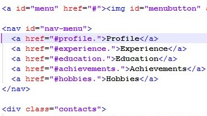

# CV

The assignment is a web based CV about myself created with **HTML5**, **CSS** and **JavaScript**. 
The CV created is mainly single-page app. This can be seen when clicking on any of the ‘a’ tags such as profile or achievements, on the navigation bar, the page scrolls down to the relevant section instead of redirecting to a new page. This was done by giving the headers id’s which also links in to the ‘href’ on the navigation bar. 
 

 
However, there is one additional page which is linked to the CV. When clicking on the send message button, CV page redirects to a page where people can send me a message if they have any questions. 

# Issues

One of the main issues I faced during the development process was rather simple, which was not being able to link the navbar to each of the headings on the CV page.  The reason for this is because I did not include ‘#’ tag after the ‘href’. Therefore, when I clicked on the on ‘a’ tags on the nav bar, they didn’t do anything.  I managed to resolve this issue by looking back at the lab work we did in Week 2. I noticed that we included the # tag after the ‘href’. Once I included this in my CV, it then worked. When I clicked on the relevant 'a' tag i.e. profile, it took me to the right heading (profile) of the CV.  
			
I had issues initially making my CV *mobile friendly*. This was because I was using 3rd party coding from w3 schools, which allowed me to use their coding to make the website responive. However, the @media was max-with, which meant it was not *mobile friendly*, so instead I used the coding from week 4 to make the CV responsive.  

In total I had **18 errors** when I put my index code in the HTML validator. Because I did a lot of hard coding, it gave me minor errors such as providing an ‘alt’ attribute for my images, which means if my images did not appear to load up for some reason, the alt attribute would replace the image with the word I named it. Resolving these errors brought my errors down to 12. In addition to this, the remaining errors I had were duplicate of ID’s. Therefore, I had change the ID of them to give each of them a unique ID which resolved the error. 

By giving all my images an alt attribute and having unique ID’s for all my texts, it cleared all the errors and warnings I received. I also cleared all the errors and issues for my contactme.html page. 

I had **two CSS errors** which I resolved instantly. I used some 3rd party coding to get the animated background to work. There was a parse error in line 9. I couldn’t identify what the error was, however I deleted the line of coding, and the error removed. This didn’t affect the animated background. The second error I had was a parse error at the end of my CSS coding. It turned out there was an unnecessary bracket which needed removing. I also used the code beautifier tool to make my CSS stylesheet look neat. 

# User Testing

I had Neil Patel to test my CV profile to see whether it met the standard of usability and if it was easy to navigate. There were several tests we carried out to see what was fine and what needed improving. The ‘not required’ means that the functionality works fine and doesn’t need to be improved. 

# References

https://developers.google.com/maps/documentation/javascript/

https://www.w3schools.com/howto/howto_css_animate_buttons.asp

https://www.w3schools.com/cssref/pr_background-image.asp

https://www.w3schools.com/cssref/pr_font_font-family.asp

https://www.w3schools.com/cssref/pr_outline-style.asp

Lab Week 02 - Link nav to each heading 

Lab Week 04 - Mobile First Responsiveness

Lab week Week 07 - Image Slideshow

			